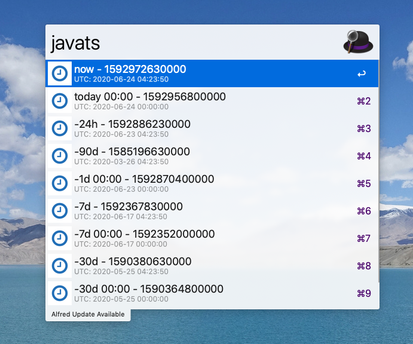

# Alfred Java Timestamp 

This workflow generates some useful utc timestamp and copy to the pasteboard.

## Step1 Install workflow to your Alfred

just double click file "Java Timestamp.alfredworkflow" to install it 

## Step2 Keyword is "javats"

done.
