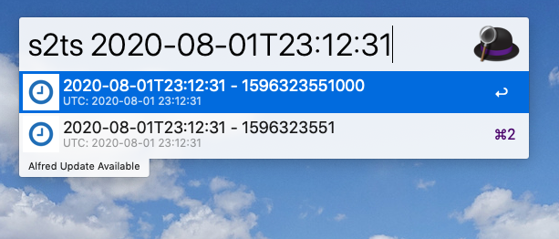

# Alfred Workflow Timestamp 

This workflow generates some useful utc timestamp and copy to the pasteboard.

## Step1 Install workflow to your Alfred

just double click file "Timestamp.alfredworkflow" to install it 

## Step2 Keyword is "javats", "ts", "ts2s", "s2ts"

done.
